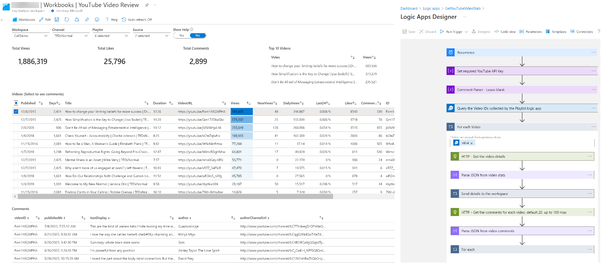

# YouTube-Logic-Apps
Monitor your YouTube videos using Logic Apps and Azure Monitor.

The following solution uses two Logic Apps to collect YouTube video metrics and comments by leveraging the YouTube API.

## How it works:

YouTube has a [broad set of APIs](https://developers.google.com/youtube/v3/docs). It can be difficult to track overall statistics like views and likes on many videos. It can also be hard to track comments. This solution pulls in the metrics and comments from your playlists for centralized reporting. This can be expanded to monitor abusive comments and viewing trends. You can track your own videos and videos owned by others (if the videos are in one of your playlists). For example, you may be featured in videos published on a channel that you do not own.

Note that most of the video data is publicly available with a legitimate API key. Some datasets and actions are only accessible as the account owner. For example, you can gather views and comments from any video but you cannot delete comments on another channel.

## Setup:

1.	You first need a YouTube account (Google Account).
2.	Add any videos that you want to track to a playlist.
3.	Get an API Key: [YouTube Data API Overview  |  Google Developers](https://developers.google.com/youtube/v3/getting-started)
*	Create a project in the Google Developers Console
*	Create a new API key
*	Restrict the key to “YouTube Data API v3” (optional)
4.	Deploy the YouTube logic apps (both require the API key and access to a Log Analytics Workspace):
  GetYouTubePlaylistVideoIDs:
*	This collects all the videos from your playlists. 
*	Depending on your upload frequency, consider scheduling this to run monthly.
	GetYouTubeVideoStats:
*	This collects the video metrics and comments.
*	Recommended to run on a 24-hour schedule.
5.	Deploy the “YouTube Video Review” workbook:
*	This gets you stated with a basic set of reporting views. [How to Deploy Workbooks](https://azurecloudai.blog/2021/03/05/how-to-deploy-a-workbook-to-azure-sentinel-from-the-github-repository)
6. Run each playbook manually to verify successful setup and to initialize the tables. Start with the playlist app. Wait 10-15 minutes for the tables to initialize.

# GetYouTubePlaylistVideoIDs

# GetYouTubeVideoStats

